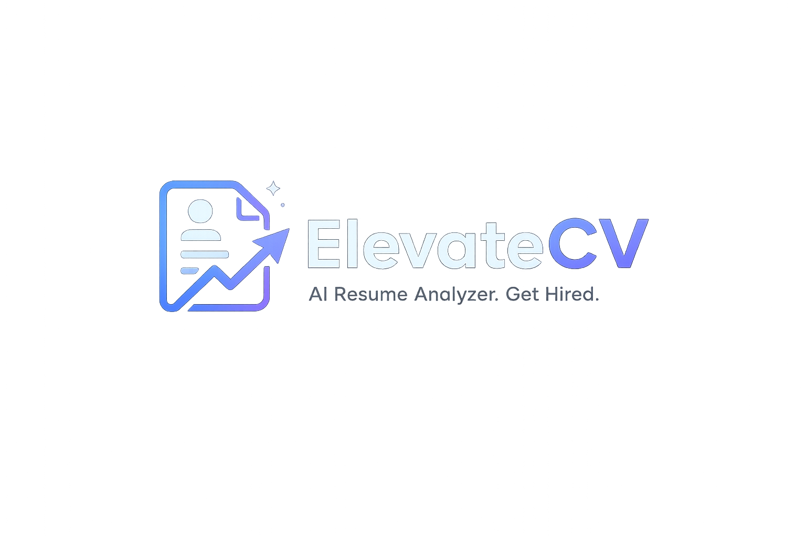

# 🚀 ElevateCV - AI Resume Analyzer

<p align="center">
  
</p>

<p align="center">
  <b>Transform Your Resume Into Interview Opportunities</b>
</p>

<p align="center">
AI-powered resume analysis platform that evaluates resumes using ATS scoring, detects skills, identifies missing keywords, and provides intelligent recommendations to improve interview success.
</p>

---

## 🌐 Live Demo

🔗 **Website:** https://elevate-cv-six.vercel.app/

🔗 **Backend API:** https://elevatecv-nc54.onrender.com

---

# ✨ Features

### 📄 Resume Upload
- Upload PDF resumes
- Drag & Drop support
- Resume validation

### 🤖 AI Resume Analysis
- ATS Score Calculation
- Resume Section Detection
- Skill Extraction
- Missing Skills Detection
- Resume Strengths
- Resume Weaknesses
- AI Recommendations
- Recruiter's Verdict

### 📊 ATS Dashboard
- Interactive ATS Score
- Score Breakdown
- Resume Statistics
- Interview Probability
- Overall Resume Rating

### 💡 AI Resume Improvement Assistant
- Professional Summary Rewrite
- Suggested Projects
- Skills to Learn
- Recommended Certifications

### 📥 Export
- Download Resume Analysis Report as PDF

### 📱 Responsive Design
- Desktop
- Tablet
- Mobile

### 🔍 SEO
- Sitemap
- robots.txt
- Open Graph Tags
- Favicon
- 404 Page

---

# 🛠️ Tech Stack

## Frontend

- HTML5
- CSS3
- JavaScript (ES6)

## Backend

- Python
- FastAPI
- PyMuPDF

## Deployment

- Vercel (Frontend)
- Render (Backend)
- GitHub

---

# 📂 Project Structure

```
ElevateCV
│
├── assets/
│   └── branding/
│
├── backend/
│   ├── analyzer.py
│   ├── ats.py
│   ├── parser.py
│   ├── rewrite.py
│   ├── skills.py
│   ├── main.py
│   └── requirements.txt
│
├── uploads/
│   └── .gitkeep
│
├── index.html
├── result.html
├── style.css
├── result.css
├── script.js
└── README.md
```

---

# ⚙️ Installation

## Clone Repository

```bash
git clone https://github.com/Space-bunny18/ElevateCV.git
```

```bash
cd ElevateCV
```

---

## Install Backend Dependencies

```bash
cd backend
```

```bash
pip install -r requirements.txt
```

---

## Start Backend

```bash
uvicorn main:app --reload
```

Backend runs on:

```
http://127.0.0.1:8000
```

---

## Open Frontend

Open

```
index.html
```

using Live Server or any local web server.

---

# 📸 Screenshots

## 🏠 Homepage

(Add Screenshot)

---

## 📤 Upload Resume

(Add Screenshot)

---

## 📊 Resume Analysis

(Add Screenshot)

---

## 📄 PDF Report

(Add Screenshot)

---

# 📈 Future Improvements

- User Authentication
- Resume History
- Multiple Resume Comparison
- AI Chat Assistant
- Job Description Matching
- Resume Templates
- Dark/Light Theme
- Multi-language Support

---

# 🤝 Contributing

Contributions, suggestions, and improvements are welcome.

1. Fork the repository
2. Create a feature branch

```bash
git checkout -b feature-name
```

3. Commit changes

```bash
git commit -m "Added new feature"
```

4. Push

```bash
git push origin feature-name
```

5. Open a Pull Request

---

# 📄 License

This project is licensed under the MIT License.

---

# 👨‍💻 Developer

**Harsh**

🎓 B.Tech CSE (AI & ML)

💼 Aspiring Software Engineer

---

## ⭐ Support

If you found this project useful, please consider giving it a ⭐ on GitHub!

It really helps and motivates future development.

---

